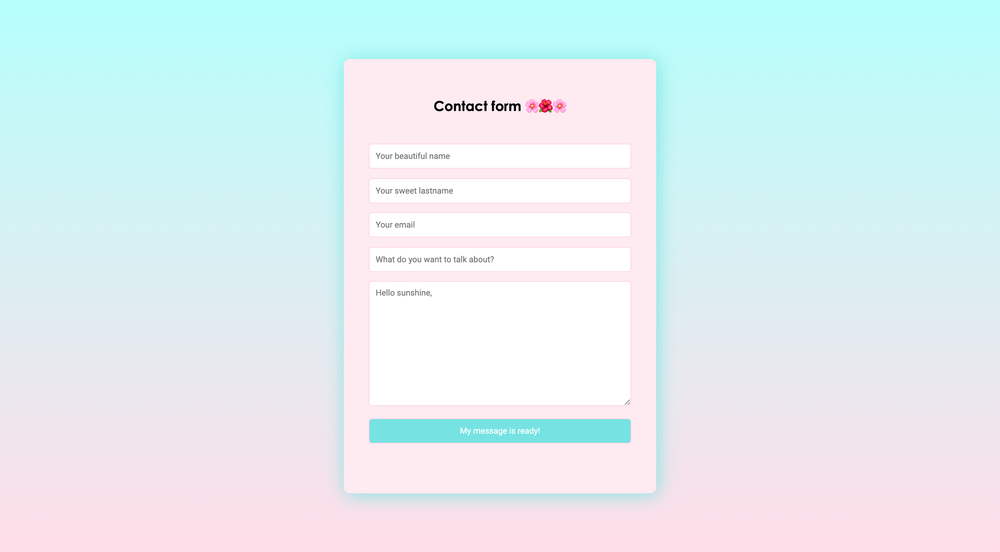

# form-back-LeReacteur

🗓 April 2021.  
🪄 Backend - contact form.  
👀 Frontend - look at the frontend repo!  
👉🏻 Check [my form](myform-lereacteur-2021.netlify.app)

## Welcome in my school exercice (contact form) 🌸🌺🌸

### My work?

To code the backend (and also the frontend ➡️ look at the repo!) of a contact form.

## Languages

JavaScript, Node.js

🙏🏻 Thank you @LeReacteur.
